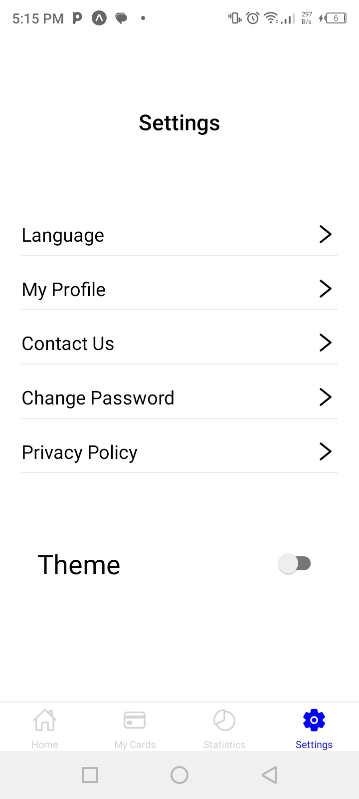

# rn-assignment3-11041617
# Brief Description about the use of components
# Components:
View:
The fundamental building block for UI elements. It groups other components and defines layout using props like flex, flexDirection, alignItems, justifyContent, and more.

Text:
Displays textual content. Use props like fontSize, fontWeight, color, and fontFamily to style the text.

ScrollView:
Enables scrolling functionality within a container. Useful for content that might exceed the screen size.

TextInput:
A single-line input field for users to enter text. Ideal for capturing short pieces of information, like search terms or notes. Consider using keyboardType for specific input types (e.g., numeric, email-address) and secureTextEntry for passwords.

StyleSheet:
A central location to define styles (like colors, fonts, margins, padding) that can be applied consistently across your components. This promotes code reusability and maintainability.

FlatList:
Components for rendering large lists of data efficiently. Use FlatList for simple homogeneous lists. Define data (the list of items), renderItem (function to render each item), and keyExtractor (function to uniquely identify each item) for optimal performance.

Image: Displays an image from a local file or remote URL. Use props like source (image path), resizeMode (how to scale the image), and style to

# Screenshots

